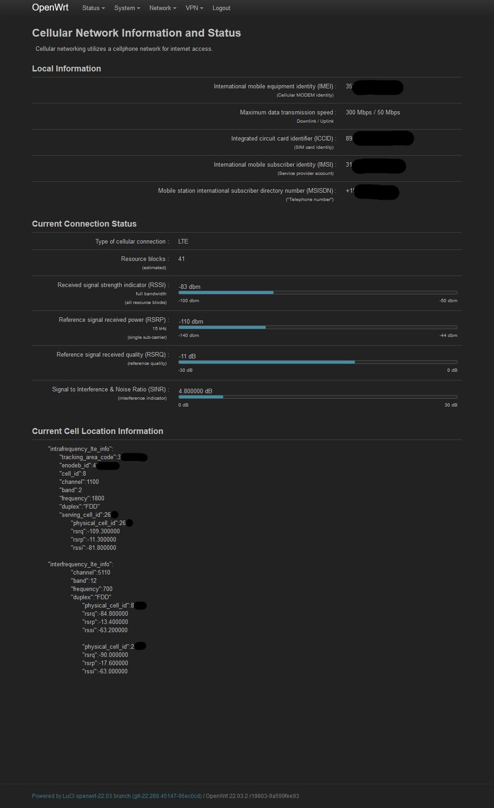

# luci-app-qmi-cellstatus
An OpenWrt luci app that adds a Cellular Status page for wireless modems with QMI drivers

If you have an LTE or UMTS modem that runs via the QMI driver on OpenWrt, feel free to install this app and test it.

Just download the luci-app-qmi-cellstatus_1.1.0_all.ipk from the Releases section, under assets; then upload it to your OpenWRT using the web user interface by navigating to:

System > Software > Upload Package ...

That's it. You may need to log out of LuCI and re-login in order to see the new entry in the Status menu.

LuCI apps are written in Lua, feel free to join and help improve this app.

Road Map:

1. Make the connection signal strength and cell location information available as JSON objects (so a home automation server could request the signal strength and cell location information form the router).
2. Improve formatting of Current Cell Location Information.

To learn about the history of this app, please see:

https://forum.openwrt.org/t/cellular-signal-level-indicator/60543/19

